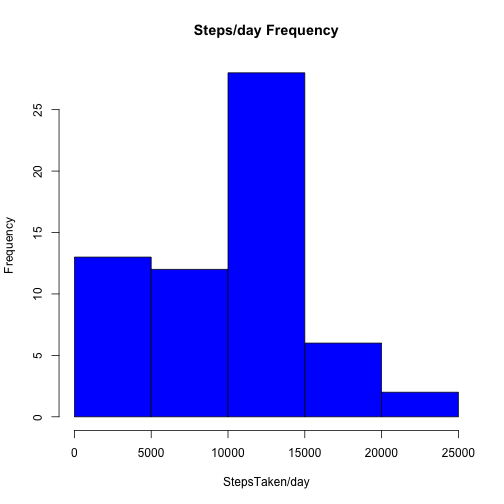
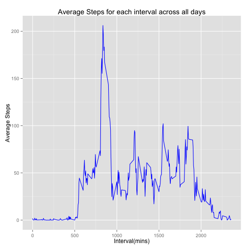
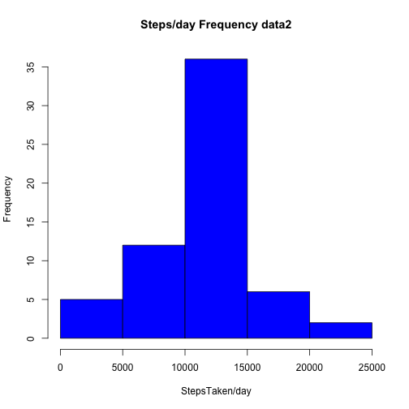
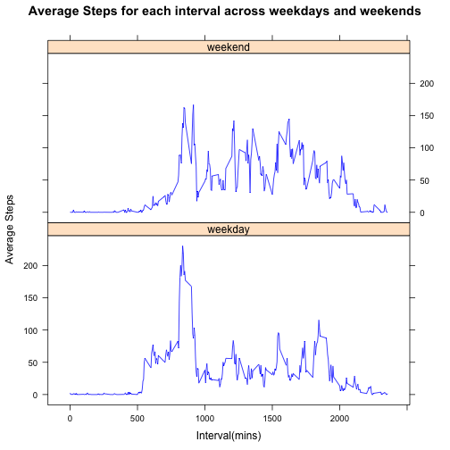

#Assignment-1 


### Loading and preprocessing the data

1- Load the data (i.e. read.csv())


```r
#Including libraries for packages and dependencies 
library(lattice)
library(ggplot2)

data <- read.csv("activity.csv")
```

2- Process/transform the data (if necessary) into a format suitable for your analysis


```r
#Convert date column of data class from factor to date
data$date <- as.Date(data[,2])
```


### What is mean total number of steps taken per day?

1- Calculate the total number of steps taken per day

```r
#*For Total Steps, loop apply cumulative sum to each cell of an array based on 'same date' condition*
Total_Steps <- tapply(data$steps, data$date, sum, na.rm = T)
```


2- Make a histogram of the total number of steps taken each day

```r
hist(Total_Steps,col ="blue", main =  "Steps/day Frequency", xlab =  "StepsTaken/day" , ylab= "Frequency" )
```

 

3- Calculate and report the mean and median of the total number of steps taken per day

```r
#Mean Steps
Mean_Steps_day <- mean(Total_Steps)
Mean_Steps_day
```

```
## [1] 9354.23
```

```r
#Median
Median_Steps_day <- median(Total_Steps)
Median_Steps_day
```

```
## [1] 10395
```


### What is the average daily activity pattern?

1- Make a time series plot of the 5-minute interval (x-axis) and the average number of steps taken, averaged across all days (y-axis)


```r
# Average number of steps taken, averaged across all days (y-axis) for each interval
Averages <- aggregate(data$steps, by=list(data$interval), FUN=mean, na.rm=TRUE)
colnames(Averages) <- c("Interval","Steps")

# plotting average steps for each interval across all days of 2 months 2012
ggplot(Averages, aes(Interval, Steps)) + geom_line(col = "blue") + xlab("Interval(mins)") + ylab("Average Steps") + ggtitle("Average Steps for each interval across all days")
```

 

2- Which 5-minute interval, on average across all the days in the dataset, contains the maximum number of steps?


```r
#maximum average step
Max_Step_Interval <- Averages[Averages$Steps == max(Averages$Steps),][1,1]
Max_Step_Interval
```

```
## [1] 835
```


### Imputing missing values

1- Calculate and report the total number of missing values in the dataset (i.e. the total number of rows with NAs)

```r
#counting total 'NA's
count = sum(is.na(data$steps))
count
```

```
## [1] 2304
```
 
 
2- Devise a strategy for filling in all of the missing values in the dataset.
 
3- Create a new dataset that is equal to the original dataset but with the missing data filled in.

```r
#inputting missing values (NAs) in orignal dataset copy with Average values of steps in Averages dataset corresponding to the interval
data2 <- data
for (i in 1:nrow(data2))
{
          if (is.na(data2[i,1]))
          {
#on missing value in data2 for steps, place steps value of Averages dataset where intervals of data2 & Averages datasets' interval match
          data2[i,1] <- Averages[which(data2$interval[i] == Averages$Interval), ][,2]
          }
}
```
 
4- Make a histogram of the total number of steps taken each day and calculate and report the mean and median total number of steps taken per day. Do these values differ from the estimates from the first part of the assignment? What is the impact of imputing missing data on the estimates of the total daily number of steps?

```r
#histogram of dataset data2
Total_Steps2 <- tapply(data2$steps, data$date, sum, na.rm = T)
hist(Total_Steps2,col ="blue", main =  "Steps/day Frequency data2", xlab =  "StepsTaken/day" , ylab= "Frequency")          
```

 

```r
#Mean Steps 2
Mean2_Steps_day <- mean(Total_Steps2)
Mean2_Steps_day
```

```
## [1] 10766.19
```

```r
#Median Steps 2
Median2_Steps_day <- median(Total_Steps2)
Median2_Steps_day
```

```
## [1] 10766.19
```
**"Yes the mean: 9,354 and median: 10,395 of orignal data set is lower compared with imputed dataset mean:10,766 and median: 10,766"** 


 
### Are there differences in activity patterns between weekdays and weekends?

1- Create a new factor variable in the dataset with two levels – “weekday” and “weekend” indicating whether a given date is a weekday or weekend day.


```r
## weekend weekday
data3 <- data2
data3[,4] <- weekdays(data$date)
```

2- Make a panel plot containing a time series plot (i.e. type = "l") of the 5-minute interval (x-axis) and the average number of steps taken, averaged across all weekday days or weekend days (y-axis). 

```r
for (i in 1:nrow(data3))
{
if (data3[i,4] == "Sunday" || data3[i,4] == "Saturday")
          {      
          data3[i,5] <- 'weekend' 
          }
else if (data3[i,4] != "Sunday" & data3[i,4] != "Saturday")
          {
          data3[i,5] <- "weekday"
          }
}          

colnames(data3) <- c("Steps","Date","Interval","Weekday","Daytype")

# Aggregating data averaged over common interval and daytype
DayType_Activity <- aggregate(data3$Steps, by = list(data3$Interval, data3$Daytype), FUN = mean, na.rm = TRUE)
# Assigning column names to new data set DayType_Activity
colnames(DayType_Activity) <- c("Interval","DayType","Steps")

#Plotting for weekdays & weekends 
xyplot(Steps ~ Interval | DayType, data = DayType_Activity, type = "l", layout =c(1,2), col = c("blue"), xlab = "Interval(mins)", ylab = "Average Steps",main = "Average Steps for each interval across weekdays and weekends")
```

 


